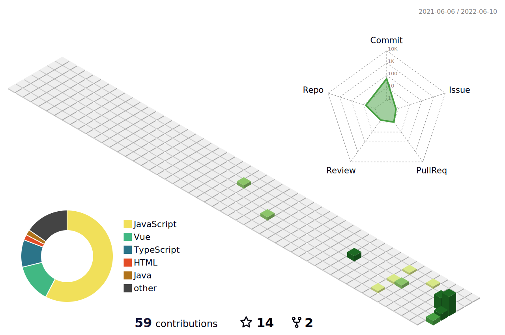

### Hi there 👋



<!--START_SECTION:waka-->


**🐱 My GitHub Data** 

> 🏆 67 Contributions in the Year 2022
 > 
> 📦 229.9 kB Used in GitHub's Storage 
 > 
> 🚫 Not Opted to Hire
 > 
> 📜 14 Public Repositories 
 > 
> 🔑 23 Private Repositories  
 > 
**I'm an Early 🐤** 

```text
🌞 Morning    94 commits     █████░░░░░░░░░░░░░░░░░░░░   23.44% 
🌆 Daytime    206 commits    ████████████░░░░░░░░░░░░░   51.37% 
🌃 Evening    98 commits     ██████░░░░░░░░░░░░░░░░░░░   24.44% 
🌙 Night      3 commits      ░░░░░░░░░░░░░░░░░░░░░░░░░   0.75%

```
📅 **I'm Most Productive on Wednesday** 

```text
Monday       46 commits     ██░░░░░░░░░░░░░░░░░░░░░░░   11.47% 
Tuesday      98 commits     ██████░░░░░░░░░░░░░░░░░░░   24.44% 
Wednesday    114 commits    ███████░░░░░░░░░░░░░░░░░░   28.43% 
Thursday     77 commits     ████░░░░░░░░░░░░░░░░░░░░░   19.2% 
Friday       61 commits     ███░░░░░░░░░░░░░░░░░░░░░░   15.21% 
Saturday     5 commits      ░░░░░░░░░░░░░░░░░░░░░░░░░   1.25% 
Sunday       0 commits      ░░░░░░░░░░░░░░░░░░░░░░░░░   0.0%

```


📊 **This Week I Spent My Time On** 

```text
⌚︎ Time Zone: Asia/Shanghai

💬 Programming Languages: 
Other                    16 hrs 28 mins      ████████████████░░░░░░░░░   65.02% 
JavaScript               5 hrs 15 mins       █████░░░░░░░░░░░░░░░░░░░░   20.73% 
Vue.js                   1 hr 50 mins        █░░░░░░░░░░░░░░░░░░░░░░░░   7.26% 
JSON                     1 hr 2 mins         █░░░░░░░░░░░░░░░░░░░░░░░░   4.13% 
Markdown                 32 mins             ░░░░░░░░░░░░░░░░░░░░░░░░░   2.12%

🔥 Editors: 
VS Code                  25 hrs 19 mins      █████████████████████████   100.0%

🐱‍💻 Projects: 
qqj_mall                 18 hrs 6 mins       ██████████████████░░░░░░░   71.53% 
http-proxy-admin         5 hrs 7 mins        █████░░░░░░░░░░░░░░░░░░░░   20.23% 
qqj_mall_copy            1 hr 15 mins        █░░░░░░░░░░░░░░░░░░░░░░░░   4.95% 
http-proxy               34 mins             ░░░░░░░░░░░░░░░░░░░░░░░░░   2.3% 
fxwiz                    15 mins             ░░░░░░░░░░░░░░░░░░░░░░░░░   0.99%

💻 Operating System: 
Windows                  25 hrs 19 mins      █████████████████████████   100.0%

```

**I Mostly Code in Vue** 

```text
Vue                      16 repos            █████████████░░░░░░░░░░░░   51.61% 
JavaScript               9 repos             ███████░░░░░░░░░░░░░░░░░░   29.03% 
Java                     3 repos             ██░░░░░░░░░░░░░░░░░░░░░░░   9.68% 
TypeScript               2 repos             █░░░░░░░░░░░░░░░░░░░░░░░░   6.45% 
HTML                     1 repo              ░░░░░░░░░░░░░░░░░░░░░░░░░   3.23%

```


**Timeline**

 


 Last Updated on 10/06/2022 15:17:44 UTC
<!--END_SECTION:waka-->

<!--
**jichangee/jichangee** is a ✨ _special_ ✨ repository because its `README.md` (this file) appears on your GitHub profile.

Here are some ideas to get you started:

- 🔭 I’m currently working on ...
- 🌱 I’m currently learning ...
- 👯 I’m looking to collaborate on ...
- 🤔 I’m looking for help with ...
- 💬 Ask me about ...
- 📫 How to reach me: ...
- 😄 Pronouns: ...
- ⚡ Fun fact: ...
-->
